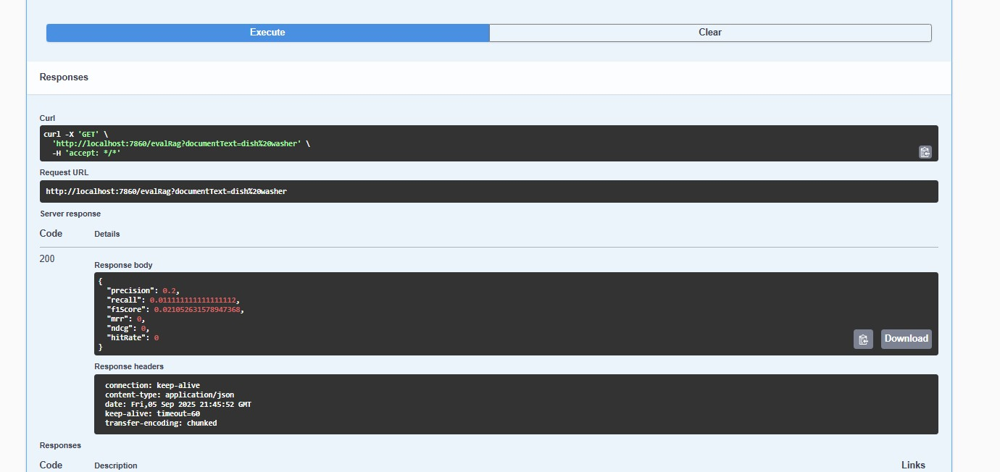

## RAG Evaluation in Java with Spring AI + VectorStore

### RAG Evaluation Metrics Cheat Sheet

When building Retrieval-Augmented Generation (RAG) systems, it’s crucial to evaluate both the retrieval quality and the generation quality of your LLM-based applications. Here’s a cheat sheet of key metrics to consider at different stages of your RAG pipeline.

We want to measure Precision, Recall, F1, MRR, nDCG, and Hit@k for your RAG implementation using Spring AI + VectorStore in your A2ARagService

| **Metric**                                         | **What It Measures**                                      | **Formula / Intuition**                                            | **When to Use**                     |
| -------------------------------------------------- | --------------------------------------------------------- | ------------------------------------------------------------------ | ----------------------------------- |
| **Precision** ✅                                    | How many retrieved docs are actually relevant             | `Precision = Relevant Retrieved / Total Retrieved`                 | If wrong docs are **costly**        |
| **Recall** ✅                                       | How many relevant docs were retrieved out of all possible | `Recall = Relevant Retrieved / All Relevant`                       | If **missing answers** is risky     |
| **F1 Score**                                       | Balance between precision & recall                        | `F1 = 2 * (Precision * Recall) / (Precision + Recall)`             | When you want a **single score**    |
| **MRR** *(Mean Reciprocal Rank)*                   | How high the **first relevant doc** is ranked             | `MRR = 1 / Rank` (averaged)                                        | For **chatbots** & **Q\&A systems** |
| **nDCG** *(Normalized Discounted Cumulative Gain)* | Measures ranking quality of multiple retrieved docs       | Rewards correct docs appearing **higher** in rank                  | For **vector DB + LLM** pipelines   |
| **Hit Rate / Recall\@k**                           | If at least 1 relevant doc is in top *k*                  | `Hit@k = (#Queries with ≥1 relevant doc in top k) / Total Queries` | Optimizing **chunk sizes** in RAG   |

Example:
If you have 10 ground-truth docs and your LLM retrieves 6 relevant docs:

Precision = 6 / 10 = 60%

Recall = 6 / 10 = 60%

If the first relevant doc is at position 2 → MRR = 1/2 = 0.5

Generation-Level Metrics (LLM Answer Quality)

Once documents are retrieved, you need to check if the LLM-generated answer is correct, factual, and

| **Metric**                        | **What It Measures**                                       | **How It's Evaluated**                      | **Use Case**                    |
| --------------------------------- | ---------------------------------------------------------- | ------------------------------------------- | ------------------------------- |
| **ROUGE**                         | Overlap between generated text & reference text            | Measures **recall** of n-grams              | Summarization, RAG              |
| **BLEU**                          | How close generated text is to expected text               | Measures **precision** of n-grams           | Machine translation, QA         |
| **METEOR**                        | Combines BLEU + synonyms + stemming                        | More semantic than BLEU                     | Open-ended LLM answers          |
| **BERTScore**                     | Embedding similarity between generated & reference answers | Uses BERT or LLM embeddings                 | RAG + semantic search           |
| **GPTScore** *(LLM-as-a-Judge)*   | Ask a stronger LLM to rate another LLM’s response          | Prompt-based scoring                        | When human labels are expensive |
| **Faithfulness / Groundedness** ✅ | Whether the LLM **sticks to retrieved docs**               | Cross-check generated answers vs. sources   | **RAG pipelines**               |
| **Hallucination Rate** ❌          | % of responses **not supported** by retrieved docs         | Count hallucinations manually or with GPT-4 | Mission-critical AI             |

Conversational & Agentic Metrics (Multi-Agent + Multi-Turn)

When you’re working with agents, MCP, A2A, or microservices-based LLMs, extra metrics come into play:

| **Metric**                       | **What It Measures**                          | **Example**                            |
| -------------------------------- | --------------------------------------------- | -------------------------------------- |
| **Conversational Coherence**     | Does the LLM maintain context across turns?   | Multi-turn chatbots                    |
| **Step Accuracy** *(for agents)* | Did each step in the **agent plan** succeed?  | Tool usage, API calls                  |
| **Tool Invocation Accuracy**     | Are the correct APIs/tools triggered?         | MCP / A2A agents                       |
| **Latency per Step**             | Time per reasoning step                       | For optimizing **multi-repo agents**   |
| **Task Success Rate**            | % of tasks completed successfully             | e.g., booking a ticket, compiling code |
| **Recovery Rate**                | How often the agent **recovers from failure** | Crucial for multi-repo workflows       |

## Business-Level & User-Centric Metrics

For production RAG or GenAI apps, you also need practical KPIs:

| **Metric**                     | **Meaning**                           | **Why It Matters**     |
| ------------------------------ | ------------------------------------- | ---------------------- |
| **User Satisfaction (CSAT)**   | Did users like the answer?            | Real-world signal      |
| **Answer Coverage**            | % of user questions answered          | Helps tune retrieval   |
| **Cost per Query**             | API + embedding + vector search costs | Budget optimization    |
| **Time-to-Answer**             | Latency between request & response    | Critical for live apps |
| **Context Window Utilization** | How much of LLM’s context is used     | Optimize chunking      |

### Putting It Together — LLM Evaluation Pyramid

Level 1 → Retrieval Metrics → Is the right info fetched? (Precision, Recall, MRR)  
Level 2 → Generation Metrics → Does the LLM give a correct answer? (ROUGE, Faithfulness, Hallucination)  
Level 3 → Agentic Metrics → Can the LLM complete multi-step tasks? (Tool Accuracy, Task Success Rate)  
Level 4 → Business Metrics → Does the solution actually work for users? (CSAT, Cost, Latency)  

### For this evaluation

We'll create 100+ documents grouped into categories:

Appliances (20 docs) → Refrigerator, Washing Machine, Dishwasher, Microwave, Vacuum, AC

Gadgets (15 docs) → Mobile, Laptop, Smartwatch, Earbuds

Troubleshooting Guides (15 docs) → Appliance errors, phone resets, laptop heating issues

Cooking Recipes (15 docs) → Semantically rich overlapping docs

Health & Wellness (10 docs) → Instructions on diet, sleep, workouts

General Distractors (15 docs) → Random docs to test precision

Semantic Variants (10 docs) → Overlapping but slightly different instructions

## Benefits of This Dataset

| **Metric** | **How Dataset Helps**            |
| ---------- | -------------------------------- |
| Precision  | Distractors + irrelevant docs    |
| Recall     | Overlapping relevant docs        |
| F1-score   | Balanced relevant/irrelevant mix |
| MRR        | Multiple docs per query          |
| nDCG       | Ranking quality tested           |

## This structure allows us to test:

Exact matches ✅

Semantic similarity ✅

Distractors & irrelevant docs ✅

Multi-turn retrieval ✅

Ranking quality ✅

## Screenshots
 